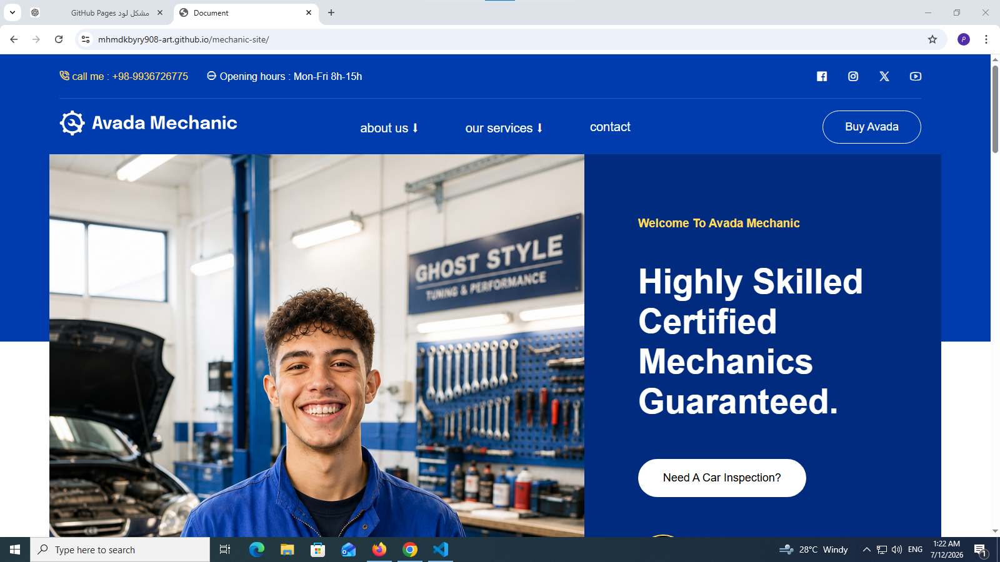
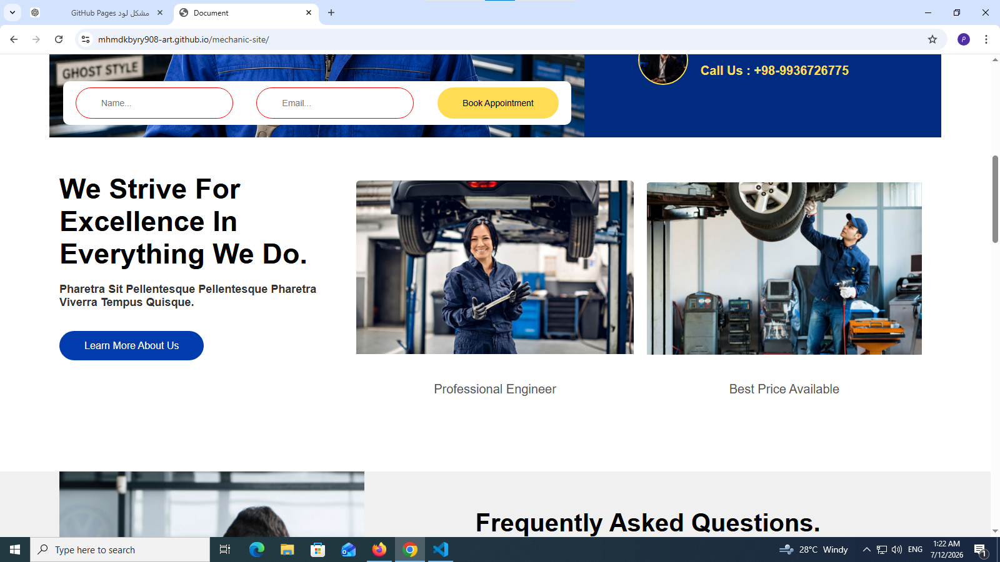
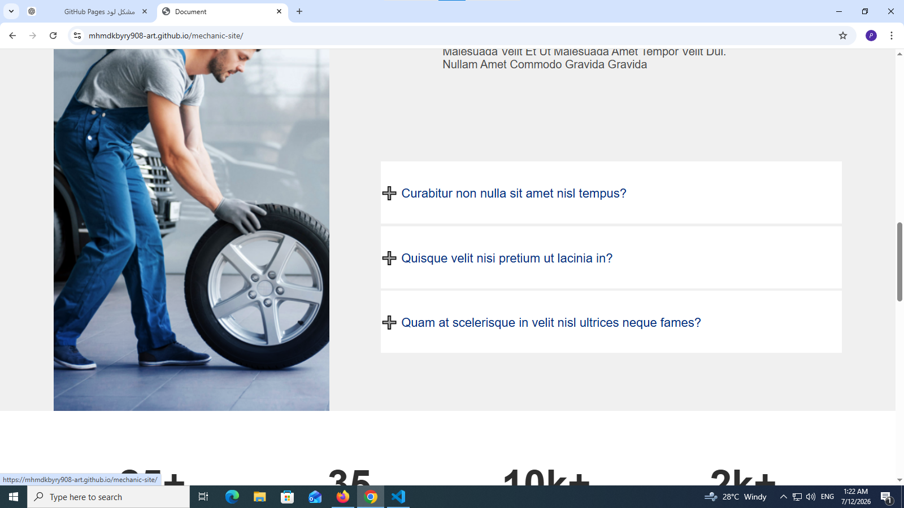
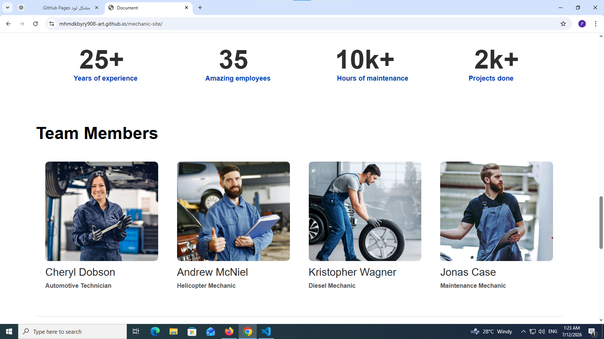
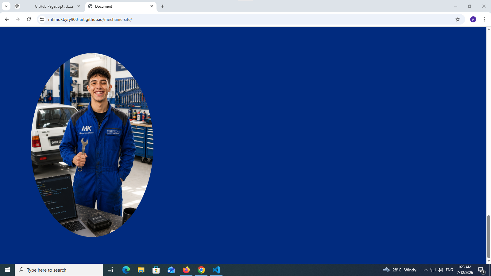

# 🚗 Mechanic Site

A modern mechanic website built with **HTML5** and **CSS3**, inspired by the Avada Mechanic template. This project focuses on clean structure, semantic HTML, modern layouts using Flexbox and CSS Grid, and an engaging user interface.

## 🌐 Live Demo

🔗 https://mhmdkbyry908-art.github.io/mechanic-site/

## 📂 Repository

🔗 https://github.com/mhmdkbyry908-art/mechanic-site

## ✨ Features

- Semantic HTML5
- Modern CSS3
- Flexbox Layout
- CSS Grid
- Responsive-ready structure
- Font Awesome Icons
- Clean & Organized Code
- Smooth UI Design

## 🛠️ Technologies Used

- HTML5
- CSS3
- Flexbox
- CSS Grid
- Git
- GitHub Pages

## 📸 Project Screenshots

  
  
  

  
  

## 📈 Future Improvements

- Responsive Design
- JavaScript Interactions
- Animations
- Dark Mode
- Performance Optimization

## 👨‍💻 Author

**Mohammad Kabiri**

- GitHub: https://github.com/mhmdkbyry908-art
- LinkedIn: https://www.linkedin.com/in/mohammad-kabiri-9875b4418

---

⭐ If you like this project, don't forget to **Star** the repository!
